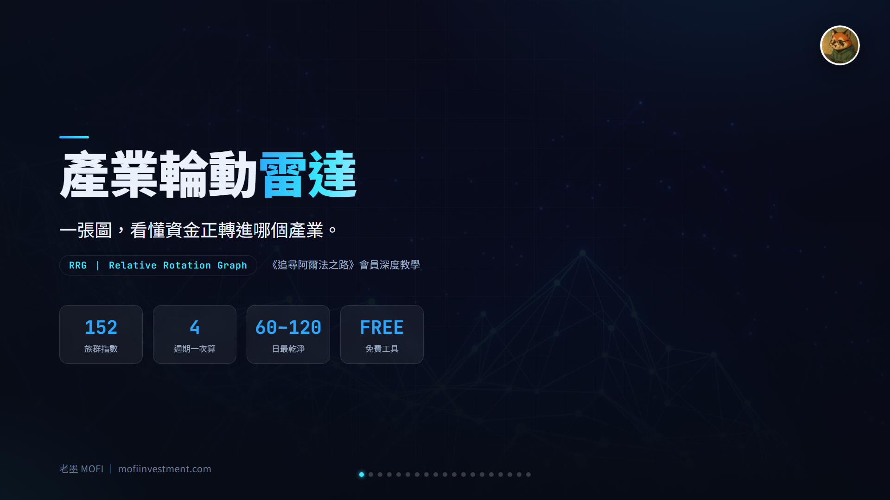
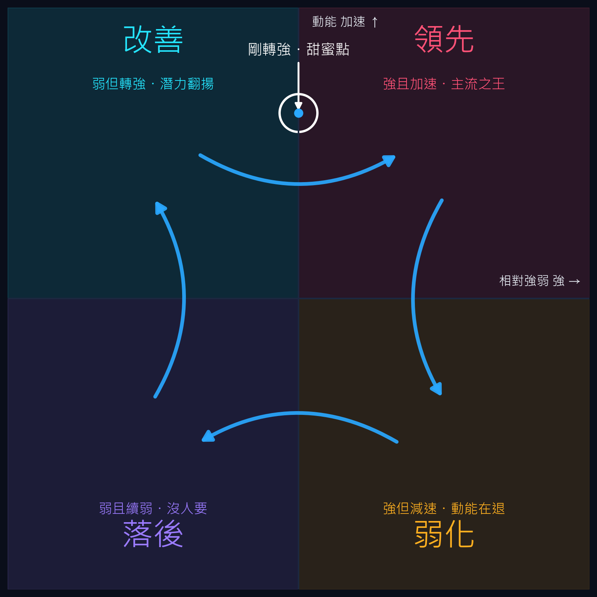
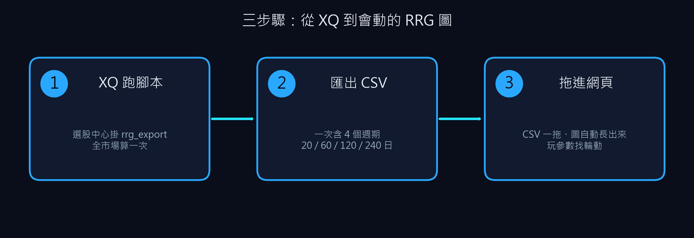
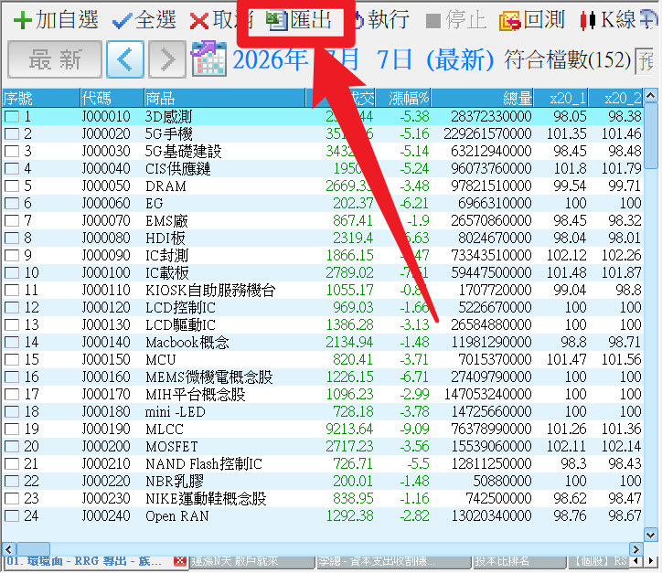
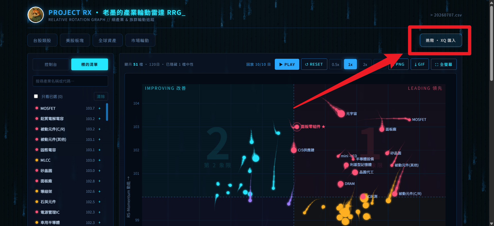
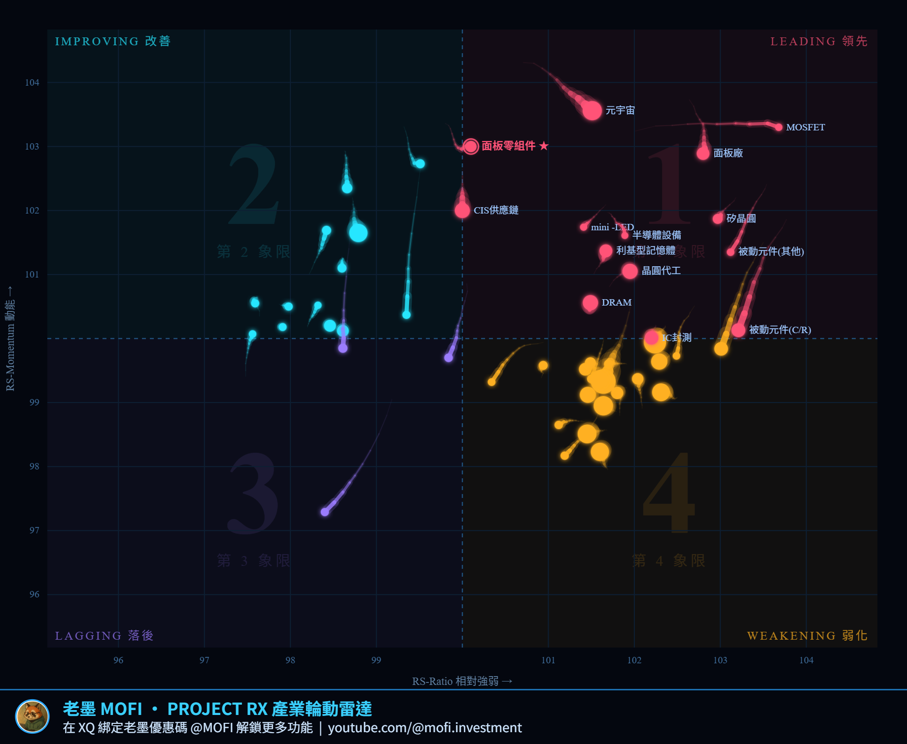
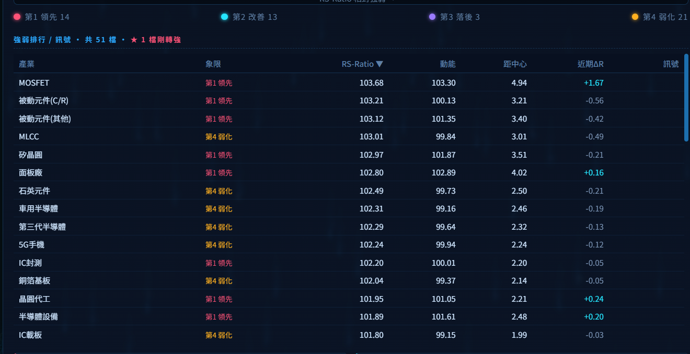
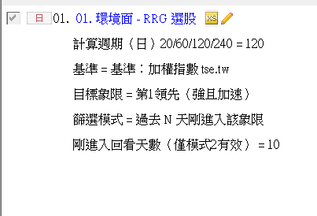
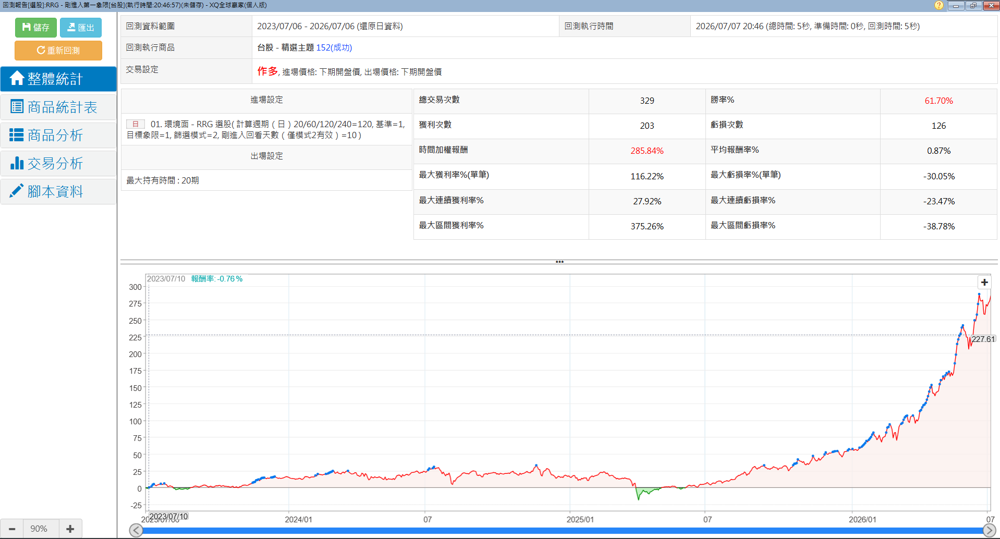

# 產業輪動雷達 RRG（台股族群 × 細產業）

**一張圖，看懂資金正輪動到哪個產業**

「資金輪動到某某產業了」這句話你聽過一百次——但到底輪到哪、輪到什麼程度、下一棒是誰？RRG 把整個市場的產業強弱畫成一張會動的雷達圖，一眼看穿。搭配老墨免費互動網頁，免安裝即用

 

-9333EA?style=flat-square)

 

  

[-3DDC84?style=for-the-badge)](https://github.com/mophyfei/MOFI_XQ/raw/main/01.%20%E7%B8%BD%E9%AB%94%E7%92%B0%E5%A2%83%E8%A7%80%E6%B8%AC/RRG%20%E7%94%A2%E6%A5%AD%E8%BC%AA%E5%8B%95%E9%81%B8%E8%82%A1%E7%AD%96%E7%95%A5/01.%20%E7%92%B0%E5%A2%83%E9%9D%A2%20-%20RRG%20%E5%B0%8E%E5%87%BA%20%E8%88%87%20%E9%81%B8%E8%82%A1%E7%AD%96%E7%95%A5.DSTX)
&nbsp;
[-00A1E0?style=for-the-badge)](https://mofiinvestment.com/tools/project_rx/)

策略包匯入 XQ 選股中心即用，已內含「導出腳本＋象限選股腳本＋設定好的商品池與參數」

### 🔑 進階功能：綁定優惠碼 `@MOFI` 解鎖

**「導出腳本 + RRG 互動網頁」完全免費、免綁碼、任何人可用**；其中「**象限選股腳本**」（在選股中心直接篩出剛轉強的產業）需在 XQ 綁定優惠碼 `@MOFI` 解鎖。綁定 `@MOFI` 為 XQ 平台官方推薦活動，可獲 XQ 點數 100 點折抵 👇

📣 **利益揭露**：綁定 `@MOFI` 為 XQ 平台官方推薦活動；老墨將因您綁定取得平台回饋（屬商業合作關係）。

> ⚠️ **使用前必讀**：本工具為**中性技術分析輔助工具**，僅將公開指數的相對強弱視覺化，**不提供任何個股買賣建議、不保證獲利**。老墨**非**經主管機關核准之證券投資顧問事業，本內容不構成投資推介。**歷史統計不代表未來表現**，投資決策與盈虧由使用者自行負責。

---

## 💡 這是什麼

> **解決的問題：把「產業輪動」從一句口號，變成一張你真的看得懂、還會動的圖。**

「資金輪動到某某產業了」——這句話人人都在講，但幾乎沒有工具能把它**畫出來**：到底輪到哪、輪到什麼程度、下一棒是誰？

**RRG（相對旋轉圖）** 是法人圈追蹤產業輪動的標準工具。老墨把它從零做出來、搬進 XQ ＋ 免費互動網頁，讓文組散戶也能用同一套視角看盤。它把每個產業畫成圖上「**一個會移動的點**」，用兩個座標定位它相對大盤的位置：

| 座標 | 白話意義 | 中立值 |
|------|---------|:---:|
| **X 軸 · 相對強弱（RS-Ratio）** | 這個產業比大盤強還是弱 | 100 |
| **Y 軸 · 強弱的加減速（RS-Momentum）** | 它的相對強弱正在變強還是變弱 | 100 |

兩個座標把圖切成**四個象限**，資金輪動大致**順時針**跑（改善 → 領先 → 弱化 → 落後 → 再回改善）：

**最值錢的一段**：從「**改善 → 領先**」的轉折，就是產業「剛轉強」的甜蜜點——工具會自動把這些剛轉強的族群標出來。

**為什麼看產業、不看個股？** 個股的雜訊多、假訊號滿天飛；**一整個產業（一籃子）的相對強弱訊號乾淨得多、容錯性更高**——先看對「風往哪吹」，再從強勢族群裡挑個股，比在單一個股上猜方向踏實。

> 🔸 這套吃的是**族群／細產業／ETF／資產大類**，不是個股。台股光族群與細產業指數，XQ 就維護了**上百個**（本工具用的「精選主題」就有 **152 檔**）；相對之下，個股大多流動性不足，畫出來會塌成中立點。

---

## 📦 你會得到什麼

| 項目 | 內容 | 解鎖 |
|------|------|:---:|
| **RRG 策略包 `.DSTX`** | 匯入 XQ 選股中心**即用、免自己設定**，內含兩支腳本＋設定好的商品池與參數： ① **導出腳本**——一次算好 4 個週期（20／60／120／240 日）的 RRG 座標，匯出 CSV ② **象限選股腳本**——直接篩出「目前位於某象限」或「最近 N 天剛進入某象限」的產業 | 導出免費 象限選股綁 `@MOFI` |
| **RRG 互動網頁** | 把 CSV 拖進[老墨的 RRG 網頁](https://mofiinvestment.com/tools/project_rx/)，就變成會動的互動 RRG 圖，自己切週期、玩參數、看回放 | 免費 · 免綁碼 |

---

## 🪜 怎麼用

### 先把策略包匯入 XQ

打開 XQ →「**策略**」→「**選股中心**」→ 點「**匯入**」→ 選下載好的 `.DSTX` 檔。匯入後，選股中心就有設定好的「RRG 導出」與「RRG 象限選股」兩個策略，**不用自己建商品池、調參數**。

### 三步驟：從 XQ 到會動的 RRG 圖

**① 在選股中心跑「導出策略」→ 匯出 CSV**

匯入策略包後，選股中心已內含設定好的商品池（台股族群 J 碼／細產業 I 碼）。選「RRG 導出」策略、日線頻率，需要的話換基準（加權指數／0050／SPY／QQQ／VT），全選後按「**匯出**」存成 CSV。

**② 把 CSV 拖進 RRG 互動網頁**

打開 [mofiinvestment.com/tools/project_rx](https://mofiinvestment.com/tools/project_rx/)，點右上「**進階 · XQ 匯入**」，把剛剛的 CSV 拖進去。

**③ 網頁變成會動的互動 RRG 圖**

自動繪出 RRG，可切 4 個週期、拉尾巴長度、過濾低量產業、動畫回放，並自動標出「剛轉強」的族群。

還附一張**強弱排行清單**，每個產業在哪象限、相對強弱與動能一目了然：

---

## 🎯 象限選股腳本（綁 `@MOFI`）

不想每次都導 CSV 看圖？這支腳本讓你在**選股中心直接篩產業**：選好目標象限與模式，執行後只顯示符合的族群。

| 參數 | 說明 | 可選 |
|------|------|------|
| 計算週期（日） | RRG 的計算天期，越大越長線 | 20／60／120／240 |
| 基準 | 相對誰算強弱 | 加權指數／0050／SPY／QQQ／VT |
| 目標象限 | 要篩哪一區 | ①領先／②弱化／③落後／④改善 |
| 篩選模式 | 全部在該象限、或只抓剛進來的 | 目前位於該象限／過去 N 天剛進入 |
| 剛進入回看天數 | 「剛進入」算幾天內（僅模式2有效） | 自訂（預設 5） |

> 💡 用「**過去 N 天剛進入 ① 領先**」這個組合，就是自動幫你抓「剛從改善轉進領先、剛轉強」的族群。輸出還會附「在此象限天數」，一眼看出是剛進來還是待很久。

---

## 📊 策略回測（產業指數層級）

以下為此篩選邏輯套在**產業／族群指數**上的歷史回溯結果（回測區間 2023/07～2026/07）：

 
▲ 圖中「勝率／進出場」等為 XQ 回測系統對<b>產業指數</b>的原生統計欄位，非個股買賣績效、非可交易標的紀錄

> ⚠️⚠️ **請務必理解這張圖的性質（重要）**：
> - 此回測的對象是**產業／族群指數**，**產業指數本身無法直接下單買賣**。這張圖**不是**任何可交易標的的績效紀錄，也**不是**個股推介。
> - 它要呈現的只是一件事：在此「篩選邏輯」之下，**產業層級的歷史統計特性**（相對強弱是否延續）。至於具體要從篩出的產業裡怎麼選個股，需由使用者自行研究判斷。
> - 圖中所有數字皆為**特定參數與特定歷史區間的回溯結果**，更換參數或期間，結果就不同。**歷史統計不代表未來、不構成買賣建議、不保證任何獲利**。

---

## 🧩 需要的 XQ 模組

| 模組 | 解鎖 | 本工具 |
|------|------|:---:|
| **籌碼模組** $500/月 | 選股中心執行本導出／選股腳本所需權限 | ✅ 必要 |
| **盤後量化選股模組** $1,000/月 | 選股中心更多執行次數 | 🔸 選配 |

> 💡 選股中心**每天有幾次免費執行額度**，一般使用免加購「盤後量化選股模組」也夠；跑很頻繁再考慮加購。RRG 互動網頁則任何裝置的瀏覽器都能開、**免任何 XQ 模組**。手機僅限監控訊號，完整功能需電腦版。[XQ 模組比較](https://www.xq.com.tw/module-compare/)。

---

## ⚠️ 使用眉角（讓畫面更乾淨）

- **RRG 是給「一籃子」用的，不是個股主場**：它吃的是**族群／細產業／ETF／資產大類**；個股大多流動性不足，會塌成中立點（100,100），看不出輪動。
- **建議從 60／120 日看起**：週期越短、塌在中立的越多；60 日以上畫面乾淨、輪動訊號穩。
- **網頁可「隱藏中性點」＋「過濾低量產業」**：把塌在中間、成交量太低的族群濾掉，圖會更好讀。

---

## ⚠️ 注意事項與免責聲明

- 🔑 「象限選股腳本」需在 XQ 綁定優惠碼 **`@MOFI`** 才能解鎖；導出腳本與 RRG 網頁**免綁碼、任何人可用**
- 📣 **利益揭露**：綁定 `@MOFI` 為 XQ 平台官方推薦活動；老墨將因您綁定取得平台回饋（屬商業合作關係）
- 本工具為**中性技術分析輔助工具**，所有數值皆為**公開指數之相對強弱統計**，**不代表未來、不構成買賣建議、不保證獲利**
- 回測對象為**產業／族群指數（不可直接交易）**，僅為統計示範，**非個股推介、非可交易標的績效、非未來績效保證**
- 老墨**非**經主管機關核准之證券投資顧問事業；本內容不構成投資推介或分析意見
- 所有腳本僅供技術研究與教學用途；投資決策與盈虧由使用者自行負責

---

[← 回到腳本庫首頁](../../README.md) ·  老墨 XQ 腳本庫 · 解鎖優惠碼 `@MOFI` · [RRG 互動網頁](https://mofiinvestment.com/tools/project_rx/)

