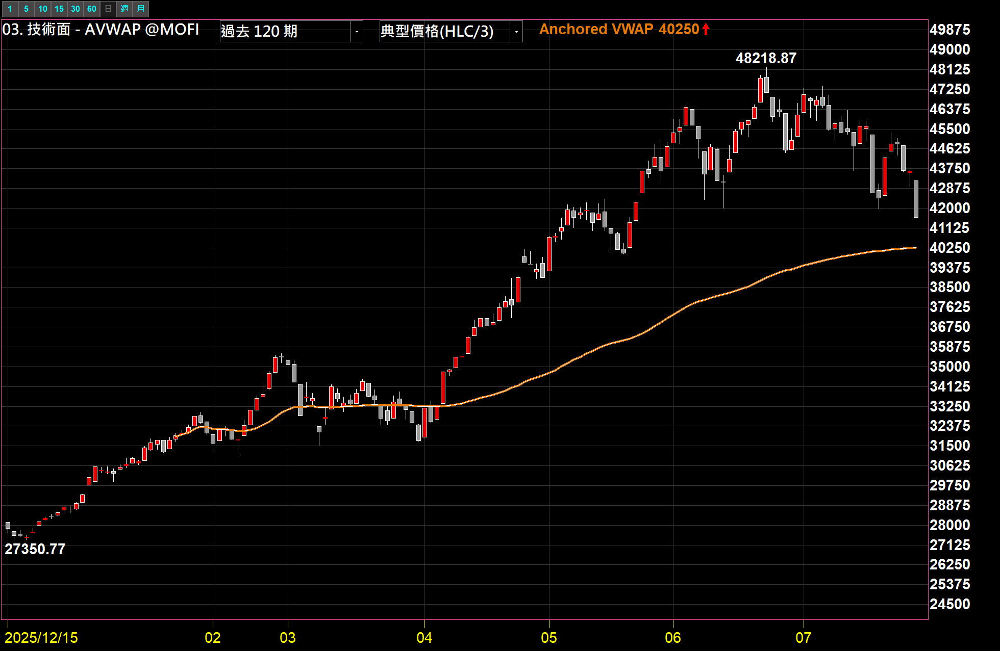
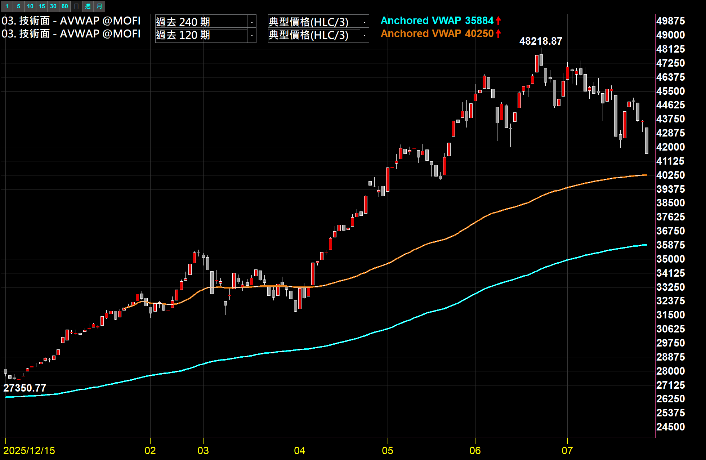
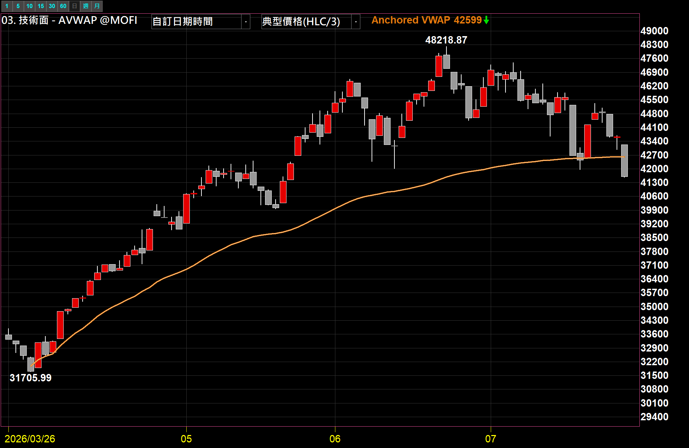
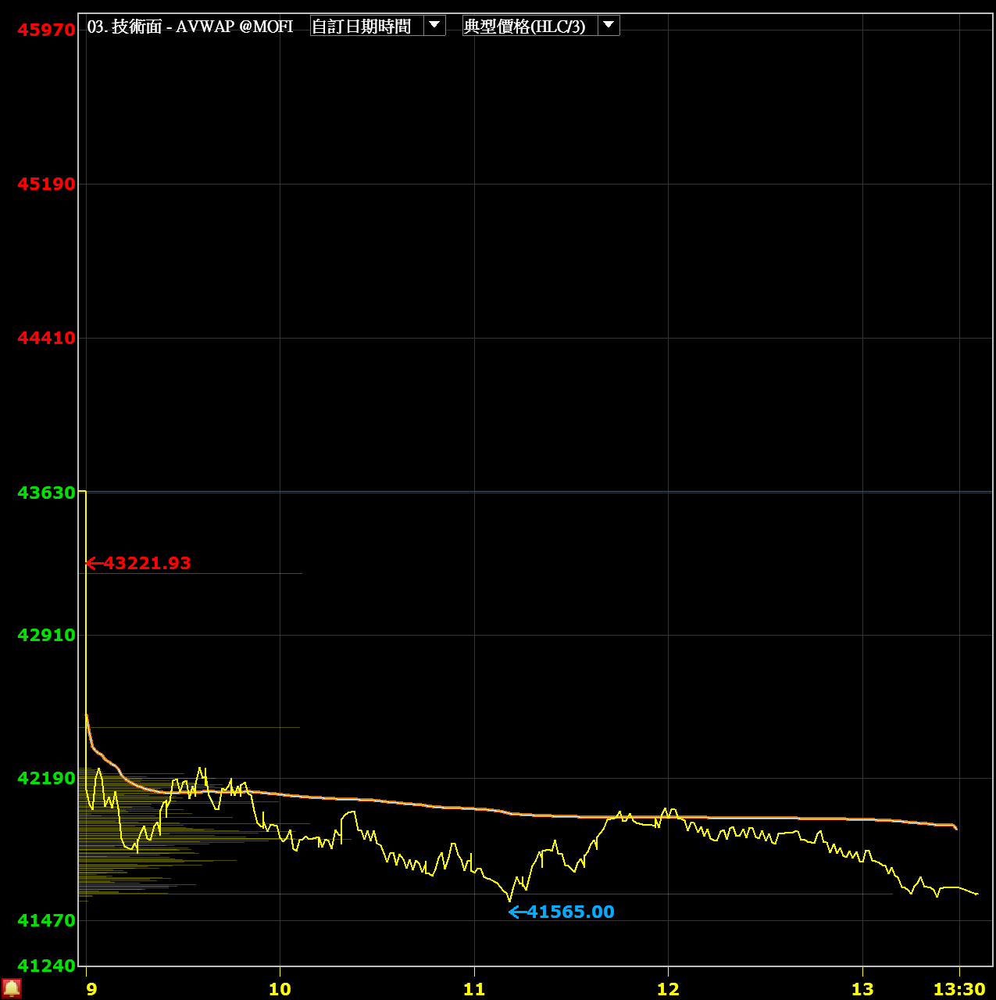
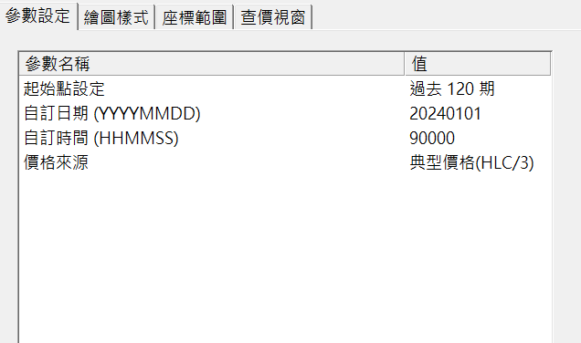

# AVWAP 錨定均價

**自己指定一個起算日，看「從那一刻到現在」市場的平均成本畫在哪裡**

Anchored VWAP（錨定成交量加權平均價）· 快速選期數與自訂日期兩種模式 · 日線與分鐘線通用

 

 

  

[-3DDC84?style=for-the-badge)](https://github.com/mophyfei/MOFI_XQ/raw/main/03.%20%E6%8A%80%E8%A1%93%E9%9D%A2%E8%A7%80%E6%B8%AC/AVWAP%20%E9%8C%A8%E5%AE%9A%E5%9D%87%E5%83%B9/03.%20%E6%8A%80%E8%A1%93%E9%9D%A2%20-%20AVWAP%20%E9%8C%A8%E5%AE%9A%E5%9D%87%E5%83%B9%20%28%E8%80%81%E5%A2%A8%E5%84%AA%E6%83%A0%E7%A2%BC%EF%BC%9A%40MOFI%29.xsb)
&nbsp;

### 🔑 使用前必做：先綁定優惠碼 `@MOFI`

**本腳本需在 XQ 綁定優惠碼 `@MOFI` 才能解鎖使用**；綁定 `@MOFI` 為 XQ 平台官方推薦活動，可獲 XQ 點數 100 點折抵 👇

---

## 💡 這是什麼

> **解決的問題：從你指定的那一天算起，市場的平均成本到底在哪裡。**

一般的移動平均線（例如 20 日均線）有兩個先天限制：

1. **每天的權重都一樣。** 成交量爆到 5000 億的那天，跟成交量只有 1500 億的那天，在均線眼裡是同一票。
2. **起算點你不能決定。** 20 日均線就是往回數 20 天，你沒辦法叫它「從那次大跌的低點開始算」。

**AVWAP（錨定成交量加權平均價）就是把這兩件事都交還給你：**

- **成交量加權** — 每根 K 棒的價格會**乘上當根的成交量**再累加，所以成交量大的價位在這條線裡佔的份量更重。它逼近的是「大部分的錢實際上成交在哪個價位」，而不是「價格的算術平均」。
- **起算點由你錨定** — 你指定一個起點（一段行情的起漲日、財報公布日、除權息日、今天開盤…），這條線就從那一刻開始一路累加下去、中途不重算。

所以這條線的數值可以白話理解成：**「從我指定的那一天到現在，所有進場的錢，平均買在這個價位。」**

價格目前在這條線的上方或下方，就代表這段期間內的整體持有成本是浮盈還是浮虧的狀態——這是一個**描述現況的數字**，不是買賣訊號。

適合：習慣用「成本」而不是「線型」在看盤的人，以及想觀察某個特定事件之後、市場籌碼成本墊在哪裡的人。

---

## 🎨 兩種錨定模式

這支腳本把「怎麼決定起算點」做成一個下拉選單，共兩種用法。

### 模式一：快速選期數（過去 20／60／120／240 期）

▲ 同一張圖掛兩條：**青色是「過去 240 期」、橘色是「過去 120 期」**。可以看到期數拉得越長，這條線的位置越低、走得越緩——因為它把更早、更便宜的那段成交也算進平均裡了。

這個模式是在**圖表載入／重新計算的當下**，從最新一根 K 棒往回數 N 根開始累加。要注意的是：之後盤中新長出來的 K 棒只會往後累加，**起算點不會自動往前移**——想讓它重新對齊最新的 N 根，重新載入圖表或動一下參數就會重算。適合當作「近 N 期平均成本」的參考線。

### 模式二：自訂日期（真正固定的錨）

▲ 起始點設定選「**自訂日期時間**」，並把日期填在一段行情的起漲日。這條線就**釘死在那一天**，之後每天累加、起算點永遠不動。

這是 AVWAP 真正的價值所在——你可以把錨下在有意義的事件上：

| 常見錨點 | 你看到的是 |
|---|---|
| 一段行情的**起漲日／起跌日** | 這一波進場的人，整體成本墊在哪 |
| **財報公布日／法說會當天** | 消息出來之後才進場的那批錢，平均買在多少 |
| **除權息日** | 貼息、填息的參考成本 |
| **大量長黑／長紅那根** | 那天恐慌或追價的人，現在是賺是賠 |

### 分鐘線：錨在今天開盤，就是當日平均成本

▲ 把日期填當天、時間填 `090000`，套在分鐘頻率上，這條橘線就是**當日累積的平均成交價**。上圖中價格多數時間運行在這條線的下方，只有盤中幾個時段短暫站上均價。

> ⏰ 「自訂時間」**只有在分鐘頻率才會生效**；日線以上（日／週／月）只會判斷日期，時間欄位會被忽略。

---

## 🪜 怎麼用

1. **匯入指標** — 用 [🚀 一鍵匯入工具](https://github.com/mophyfei/MOFI_XQ/releases/latest/download/XQ-Script-Importer.exe) 匯入最快；或手動：XQ →「**策略**」→ **XScript 編輯器** →「**匯入**」→ 選 `.xsb` 檔 → 按 <kbd>F6</kbd> 編譯。
2. **加到技術分析圖** — 本指標畫在**主圖**（跟 K 棒疊在一起），加入後套用到任一檔商品皆可。
3. **選起算點** — 打開參數設定，在「**起始點設定**」下拉選單挑「過去 20／60／120／240 期」其中一個；想釘死某一天就選「**自訂日期時間**」，再去下面填日期。
4. **想比較多條就重複加入** — 同一張圖可以把這支指標加入多次、各自設不同期數或不同錨點（記得把顏色調開），就會長成上面那張青橘雙線的樣子。

---

## ⚙️ 參數說明

| 參數 | 說明 | 預設值 | 可選 |
|------|------|:---:|------|
| **起始點設定** | 決定從哪裡開始累加 | 過去 20 期 | 過去 20 期／過去 60 期／過去 120 期／過去 240 期／**自訂日期時間** |
| **自訂日期 (YYYYMMDD)** | 錨點的日期，八位數字。**只有上面選「自訂日期時間」時才生效** | 20240101 | 例：`20260326` |
| **自訂時間 (HHMMSS)** | 錨點的時間，六位數字。**只有選「自訂日期時間」且圖表為分鐘頻率時才生效** | 090000 | 例：`090000` |
| **價格來源** | 每根 K 棒要拿哪個價格去乘上成交量 | 典型價格(HLC/3) | 典型價格(HLC/3)／收盤價 |

**兩個小提醒**

- 「自訂時間」填 `090000` 存檔後，畫面上會顯示成 `90000`（開頭的 0 被省略），這是正常的，不影響計算。
- **價格來源**兩個選項的差別通常很小：「典型價格」是把每根 K 棒的最高、最低、收盤三個價格平均（HLC/3），比單看收盤價更能代表那根 K 棒整體的成交位置；「收盤價」則跟大多數市面上的 VWAP 算法一致。想跟其他軟體的數字對齊就選收盤價，想更貼近實際成交分布就用典型價格。

---

## 🧩 需要的 XQ 模組

本腳本為**自訂 XScript 指標**，需訂閱：

| 模組 | 解鎖 | 本腳本 |
|------|------|:---:|
| **盤中量化交易模組** $1,000/月 | 自訂指標／XScript、策略雷達、警示、回溯、自動交易 | ✅ 必要 |

> 💡 自訂指標屬「盤中量化交易模組」。本指標只用到價格與成交量資料，**不需**盤後或美股模組。手機僅限監控訊號，完整功能需電腦版。[XQ 模組比較](https://www.xq.com.tw/module-compare/)。

---

## 📌 使用須知

- 🔑 需在 XQ 綁定優惠碼 **`@MOFI`** 才能解鎖使用。
- 📉 **錨點之前不會有線**。選「自訂日期時間」時，圖表上早於錨點的那段是空白的，這是正常的；如果整條線都沒出現，先確認圖表載入的資料有涵蓋到你填的那個日期。
- 📊 **無量的商品會算不出數字**。這條線需要成交量才能加權，成交量長期為零的商品畫不出來。
- 🎨 線的顏色、粗細請在 XQ 前台的「繪圖樣式」自行調整。**這支腳本有兩個繪圖輸出**（本體與一條疊在上面的細線），調色時記得兩個一起調，才不會留下一條沒改到的線。
- 🖼️ 本頁截圖為老墨個人的配色與參數習慣（例如封面用的是「過去 120 期」，不是預設的 20 期），不同解析度與版面下畫面可能略有差異。

---

## ⚠️ 免責聲明與利益揭露

**📣 利益揭露**
綁定優惠碼 `@MOFI` 為 XQ 平台官方推薦活動；老墨將因您綁定取得平台回饋，屬商業合作關係。

**工具性質**
本腳本為中性技術分析輔助工具，畫面上的數值皆為依公開價量資料計算之平均成本，僅將既有資料視覺化，不研判走勢、不構成買賣建議、不保證獲利。

**非投顧事業**
老墨非經主管機關核准之證券投資顧問事業。本頁面全部內容不構成投資推介、分析意見或任何形式之投資顧問服務。

**關於本頁截圖**
本頁所有畫面截圖中出現之商品代號、名稱、報價與數值，均僅為功能之示範，非推介標的，不代表老墨持有該等商品或建議買賣。

**歷史數據之限制**
所有數值均為對過去資料之計算，歷史表現不代表未來結果。程式邏輯與資料來源均可能存在誤差。

**風險自負**
本腳本僅供技術研究與教學用途。任何投資決策應由使用者依自身判斷為之，所生盈虧由使用者自行承擔。

---

[← 回到腳本庫首頁](../../README.md) ·  老墨 XQ 腳本庫 · 解鎖優惠碼 `@MOFI`

