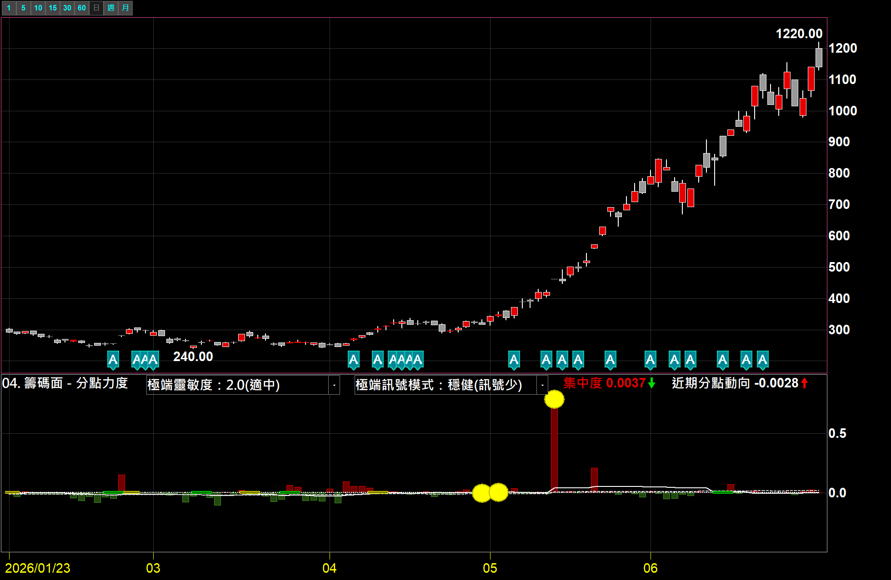
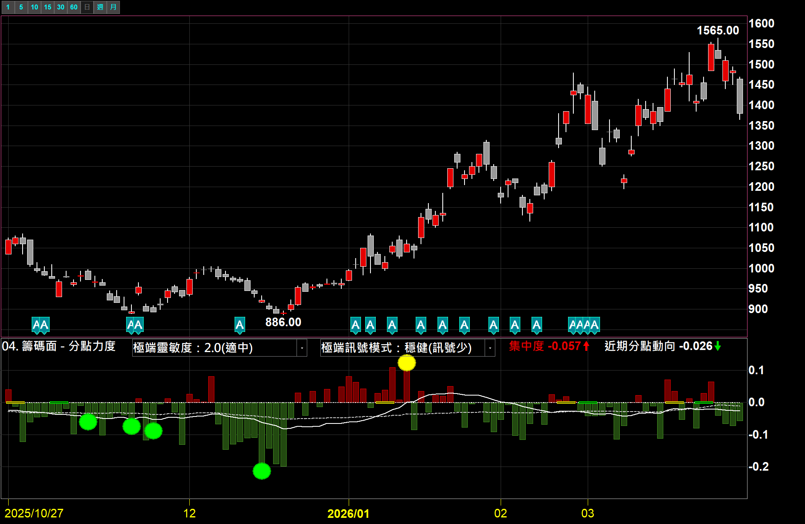
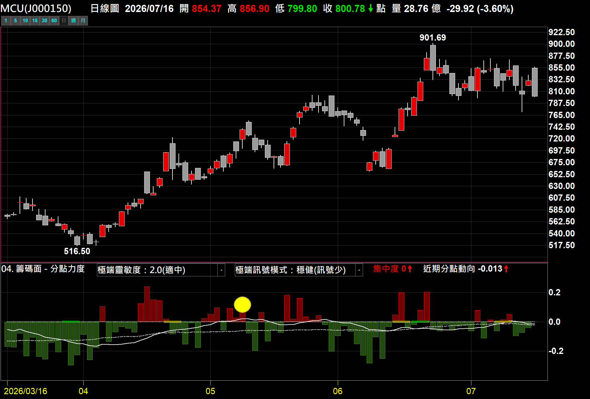
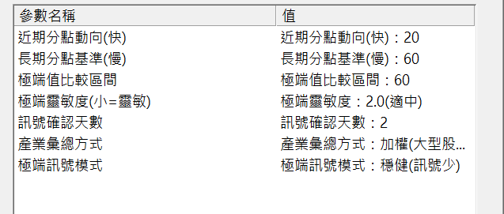

# 分點力度指標（支援族群產業透視）

**看「分點」籌碼是集中在少數人、還是分散給大家——連「產業級別」都能看**

不是看買賣張數，是看「買賣的分點有多集中」。標準化後可跨股比較，還能掛在產業類股指數上，自動彙總整個產業的分點籌碼——多數籌碼指標做不到的事

 

 

  

[-3DDC84?style=for-the-badge)](https://github.com/mophyfei/MOFI_XQ/raw/main/04.%20%E7%B1%8C%E7%A2%BC%E9%9D%A2%E8%A7%80%E6%B8%AC/%E5%88%86%E9%BB%9E%E5%8A%9B%E5%BA%A6/04.%20%E7%B1%8C%E7%A2%BC%E9%9D%A2%20-%20%E5%88%86%E9%BB%9E%E5%8A%9B%E5%BA%A6.xsb)
&nbsp;

### 🔑 使用前必做：先綁定優惠碼 `@MOFI`

**本腳本需在 XQ 綁定優惠碼 `@MOFI` 才能解鎖使用**；綁定 `@MOFI` 為 XQ 平台官方推薦活動，可獲 XQ 點數 100 點折抵 👇

---

## 💡 這是什麼

> **解決的問題：籌碼是集中在少數人、還是分散給大家？**

同樣是「買」，一種是**集中在少數分點**慢慢吃、一種是**一堆分點各買一點**。前者代表籌碼在收斂、後者代表在發散——這件事，光看買賣張數看不出來，得看「**分點**」。

**分點力度**把分點籌碼換算成一條**集中度**：**往上＝籌碼集中（流向少數分點）、往下＝籌碼分散（流向多數分點）**，並幫你標出真正值得注意的極端集中／極端分散。

---

## 🌟 為什麼這支不一樣

<table>
<tr>
<td width="33%" valign="top" align="center">

**① 看「分點」，不是看張數**

一般籌碼指標看「買超幾張」；這支看「**買賣的分點有多集中**」——同樣買超，集中在少數分點、還是撒給一堆分點，意義完全不同。

</td>
<td width="33%" valign="top" align="center">

**② 連「產業」都能看**

多數籌碼指標只能看個股。這支**掛在產業類股指數上，會自動彙總整個產業成分股的分點籌碼**——分點資料能做到產業級別，市面上少見。

</td>
<td width="33%" valign="top" align="center">

**③ 標準化，可跨股比較**

大型股、小型股的分點家數天差地遠。這支標準化成同一把尺（−1～+1），**不同股票之間可以直接比集中度**。

</td>
</tr>
</table>

> 💡 而且它幫你把「一天集中、一天分散」的雜訊過濾掉，只標出**真正值得注意的那一次極端集中／極端分散**，不用自己盯著跳動的數字猜。

---

## 🪜 怎麼用

### ① 匯入指標

用 [🚀 一鍵匯入工具](https://github.com/mophyfei/MOFI_XQ/releases/latest/download/XQ-Script-Importer.exe) 匯入；或手動：XQ →「**策略**」→ **XScript 編輯器** →「**匯入**」→ 選 `.xsb` → 按 <kbd>F6</kbd> 編譯。

### ② 加到副圖 → 看集中度

**加入指標**，套用到**個股**或**產業類股指數**（別掛大盤）。副圖會顯示集中度線、近期／長期兩條分點動向線，以及極端訊號標記。

 
▲ 集中度線＋近期/長期分點動向，並標出極端集中/極端分散的位置

### ③ 掛產業類股指數 → 看整個產業

同一支指標掛到**產業類股指數**，會自動彙總該產業成分股的分點籌碼，一眼看整個產業的集中/分散。

 
▲ 掛在產業類股指數：自動彙總成分股分點籌碼（產業彙總可選「加權」或「等權」）

---

## ⚙️ 參數說明

| 參數 | 說明 | 可選 |
|------|------|------|
| 極端靈敏度 | 超過多少算「極端」，小＝靈敏 | 1.5／2.0／2.5 |
| 極端訊號模式 | 靈敏（訊號多）／穩健（訊號少） | 靈敏／穩健 |
| 產業彙總方式 | 掛產業指數時的彙總法 | 加權（大型股佔重）／等權（各檔同權重）|
| 近期分點動向（快）| 短期均線期數 | 10／20／30 |
| 長期分點基準（慢）| 長期基準均線期數 | 40／60／120 |
| 極端值比較區間 | 判斷極端的統計視窗 | 20／60／120 |
| 訊號確認天數 | 連續幾日成立才標記，濾假訊號 | 1／2／3 |

---

## 🧩 需要的 XQ 模組

| 模組 | 解鎖 | 本腳本 |
|------|------|:---:|
| **盤中量化交易模組** $1,000/月 | 自訂指標／XScript、策略雷達、警示、回溯、自動交易 | ✅ 必要 |
| **籌碼模組** $500/月 | 族群／產業層級的籌碼資料 | 🔸 要「族群產業透視」才需要 |

> 💡 自訂指標屬「盤中量化交易模組」；**掛個股單看免加購**，要用「掛產業類股指數、透視整個族群產業」的功能才需另加「籌碼模組」。手機僅限監控訊號，完整功能需電腦版。[XQ 模組比較](https://www.xq.com.tw/module-compare/)。

---

## 📌 使用須知

- 🔑 需在 XQ 綁定優惠碼 **`@MOFI`** 才能解鎖使用

---

## ⚠️ 免責聲明與利益揭露

**📣 利益揭露**
綁定優惠碼 `@MOFI` 為 XQ 平台官方推薦活動；老墨將因您綁定取得平台回饋，屬商業合作關係。

**工具性質**
本腳本為中性技術分析輔助工具，所有數值皆為公開分點籌碼之客觀統計，不代表未來、不構成買賣建議、不研判特定人進出、不保證獲利。

**非投顧事業**
老墨非經主管機關核准之證券投資顧問事業。本頁面全部內容不構成投資推介、分析意見或任何形式之投資顧問服務。

**關於本頁截圖**
本頁所有畫面截圖中出現之商品代號、名稱、報價與數值，均僅為功能之示範，非推介標的，不代表老墨持有該等商品或建議買賣。

**歷史數據之限制**
所有統計數值均為對過去資料之計算，歷史表現不代表未來結果。程式邏輯與資料來源均可能存在誤差。

**風險自負**
本腳本僅供技術研究與教學用途。任何投資決策應由使用者依自身判斷為之，所生盈虧由使用者自行承擔。

---

[← 回到腳本庫首頁](../../README.md) ·  老墨 XQ 腳本庫 · 解鎖優惠碼 `@MOFI`

