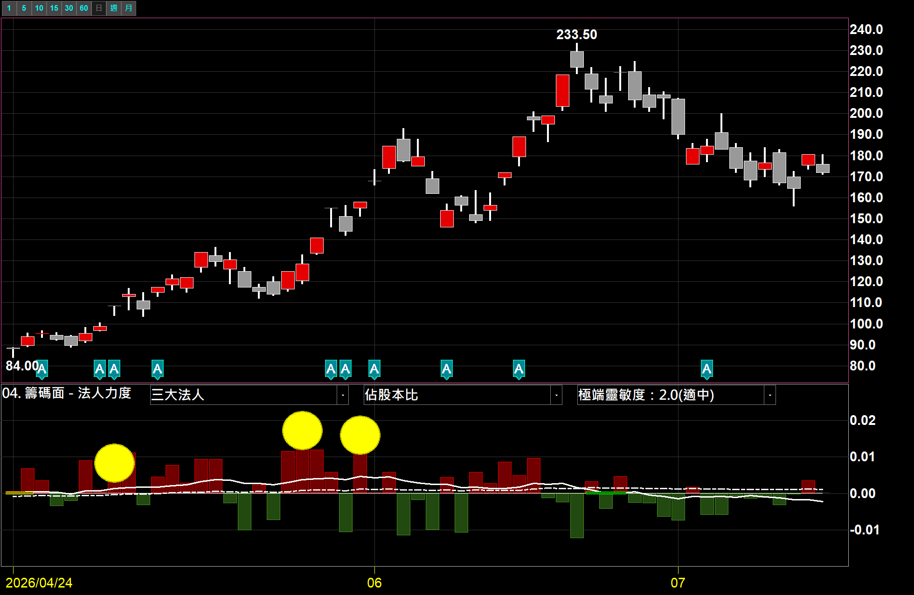
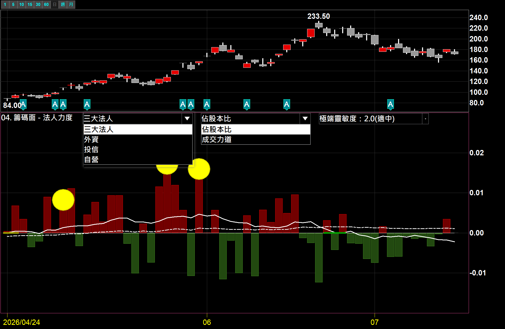
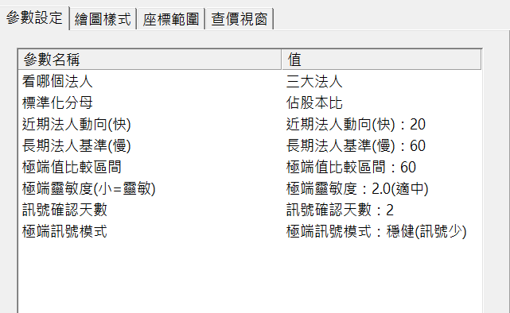

# 法人力度指標（含投本比）

**法人到底站買方還是賣方、力道多重——濾掉一天買一天賣的雜訊，標出真正該注意的那一次**

三大法人／外資／投信／自營，搭配「佔股本比」或「成交力道」兩種標準化，自由組合。投信 × 佔股本比＝經典投本比。標準化後可跨股比較，個股、產業類股兩用

 

 

⚠️ 示意圖，僅為功能示範，非個股推介

  

[-3DDC84?style=for-the-badge)](https://github.com/mophyfei/MOFI_XQ/raw/main/04.%20%E7%B1%8C%E7%A2%BC%E9%9D%A2%E8%A7%80%E6%B8%AC/%E6%B3%95%E4%BA%BA%E5%8A%9B%E5%BA%A6/04.%20%E7%B1%8C%E7%A2%BC%E9%9D%A2%20-%20%E6%B3%95%E4%BA%BA%E5%8A%9B%E5%BA%A6.xsb)
&nbsp;

### 🔑 使用前必做：先綁定優惠碼 `@MOFI`

**本腳本需在 XQ 綁定優惠碼 `@MOFI` 才能解鎖使用**；綁定 `@MOFI` 為 XQ 平台官方推薦活動，可獲 XQ 點數 100 點折抵 👇

📣 **利益揭露**：綁定 `@MOFI` 為 XQ 平台官方推薦活動；老墨將因您綁定取得平台回饋（屬商業合作關係）。

> ⚠️ **使用前必讀**：本工具為**中性技術分析輔助工具**，僅將公開法人買賣超資料視覺化，**不提供任何個股買賣建議、不保證獲利**。老墨**非**經主管機關核准之證券投資顧問事業，本內容不構成投資推介。**歷史統計不代表未來表現**，投資決策與盈虧由使用者自行負責。

---

## 💡 這是什麼

> **解決的問題：法人到底站買方還是賣方、力道多重？**

法人一天買、一天賣，原始的買賣超數字漲漲跌跌，很難看出**哪一次才是真的用力**。**法人力度**把法人買賣超**標準化**成一個繞零軸的力道比率：往上＝站買方、往下＝站賣方，並幫你**濾掉一天買一天賣的雜訊、標出真正值得注意的那一次極端買超／極端賣超**。

---

## 🌟 為什麼這支不一樣

<table>
<tr>
<td width="33%" valign="top" align="center">

**① 4 法人 × 2 分母，自由組合**

看**三大法人／外資／投信／自營**任一種，搭配**佔股本比**或**成交力道**兩種標準化——想看哪種力道自己配。

</td>
<td width="33%" valign="top" align="center">

**② 內建經典「投本比」**

**投信 × 佔股本比**，就是市場常看的**投本比**（投信買超佔股本多少）；**外資 × 成交力道**則看外資今日力道。一支全包。

</td>
<td width="33%" valign="top" align="center">

**③ 濾雜訊、標重點**

不用盯著法人一天買一天賣的跳動猜——直接幫你標出**真正該注意的那一次**極端買超/賣超。

</td>
</tr>
</table>

> 💡 標準化後大小型股拉到同一把尺，**不同股票之間可以直接比法人力道**；個股、產業類股都能掛。

---

## 🪜 怎麼用

### ① 匯入指標

用 [🚀 一鍵匯入工具](https://github.com/mophyfei/MOFI_XQ/releases/latest/download/XQ-Script-Importer.exe) 匯入；或手動：XQ →「**策略**」→ **XScript 編輯器** →「**匯入**」→ 選 `.xsb` → 按 <kbd>F6</kbd> 編譯。

### ② 加到副圖 → 選法人 × 分母

**加入指標**，套用到**個股**或**類股指數**（別掛大盤）。用兩個下拉自由組合：**看哪個法人**（三大／外資／投信／自營）× **標準化分母**（佔股本比／成交力道）。

 
▲ 兩個下拉自由組合：三大法人/外資/投信/自營 × 佔股本比/成交力道　⚠️ 示意圖，非個股推介

### ③ 看力道與極端訊號

副圖顯示法人力道線、近期／長期兩條動向線，並標出「買方轉強／賣方轉強」與「極端買超／極端賣超」。

---

## ⚙️ 參數說明

| 參數 | 說明 | 可選 |
|------|------|------|
| 看哪個法人 | 選買賣超的法人別 | 三大法人／外資／投信／自營 |
| 標準化分母 | 決定看哪一種力道 | 佔股本比（佈局深度）／成交力道（當日力道）|
| 極端靈敏度 | 超過多少算「極端」，小＝靈敏 | 1.5／2.0／2.5 |
| 極端訊號模式 | 靈敏（訊號多）／穩健（訊號少）| 靈敏／穩健 |
| 近期法人動向（快）| 短期均線期數 | 10／20／30 |
| 長期法人基準（慢）| 長期基準均線期數 | 40／60／120 |
| 極端值比較區間 | 判斷極端的統計視窗 | 20／60／120 |
| 訊號確認天數 | 連續幾日成立才標記，濾假訊號 | 1／2／3 |

---

## 🧩 需要的 XQ 模組

| 模組 | 解鎖 | 本腳本 |
|------|------|:---:|
| **盤中量化交易模組** $1,000/月 | 自訂指標／XScript、策略雷達、警示、回溯、自動交易 | ✅ 必要 |
| **籌碼模組** $500/月 | 族群／產業層級的籌碼資料 | 🔸 要「族群產業透視」才需要 |

> 💡 自訂指標屬「盤中量化交易模組」；**掛個股單看免加購**，要用「掛類股指數、透視整個族群產業」的功能才需另加「籌碼模組」。手機僅限監控訊號，完整功能需電腦版。[XQ 模組比較](https://www.xq.com.tw/module-compare/)。

---

## ⚠️ 注意事項與免責聲明

- 🔑 需在 XQ 綁定優惠碼 **`@MOFI`** 才能解鎖使用
- 📣 **利益揭露**：綁定 `@MOFI` 為 XQ 平台官方推薦活動；老墨將因您綁定取得平台回饋（屬商業合作關係）
- 本工具為**中性技術分析輔助工具**，所有數值皆為**公開法人買賣超之客觀統計**，**不代表未來、不構成買賣建議、不保證獲利**
- 老墨**非**經主管機關核准之證券投資顧問事業；本內容不構成投資推介或分析意見
- 所有腳本僅供技術研究與教學用途；投資決策與盈虧由使用者自行負責

---

[← 回到腳本庫首頁](../../README.md) ·  老墨 XQ 腳本庫 · 解鎖優惠碼 `@MOFI`

